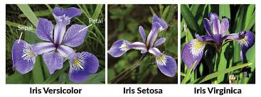

# klasifikasi iris WML

## Deskripsi

iris dataset berisi dataset bunga iris yang terdiri dari tiga kelas spesies yaitu **Versicolor**, **Setosa**, dan **Virginica**. Dataset iris memiliki fitur seperti pada tabel berikut
| Parameter | Type     |              |
| :-------- | :------- | :------------------------- |
| sepal_length | `string` |
| sepal_width | `string` |
| petal_length | `string` | 
| petal_width | `string` | 

## Deployment
Model di deploy pada watson machine learning deployment space dengan format pmml.

### endpoint
https://us-south.ml.cloud.ibm.com/ml/v4/deployments/d42cd2d2-4dcc-44d3-8b28-9d09bb29a88c/predictions?version=2021-05-01

## Examples
- [python code untuk request http client](./python/iris-http-request.py)
- [python interface menggunakan gradio](./python/iris-classification-interface.py)
