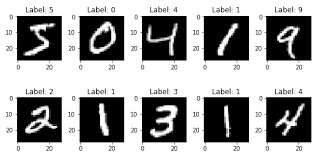

# MNIST | Klasifikasi angka tulisan tangan WML

## Deskripsi

Mnist dataset berisi kumpulan gambar angka tulisan tangan dari 0-9 dengan ukuran piksel 28x28. Digunakan dalam pengembangan model deep learning pengenalan karakter atau pemrosesan citra. Data piksel dikirim dalam format json setelah dilakukan flatten, yaitu mengubah dimensi array yang sebelumnya 28x28 menjadi 784

## Deployment
Model di deploy pada watson machine learning deployment space dengan format pmml

### endpoint
https://us-south.ml.cloud.ibm.com/ml/v4/deployments/bf506f75-1262-4cc9-ad9c-fb2d2cda377f/predictions?version=2021-05-01

## Examples
- [python code untuk request http client](./python/mnist-http-request.py)
- [python interface menggunakan gradio](./python/handwriting-interface.py)

